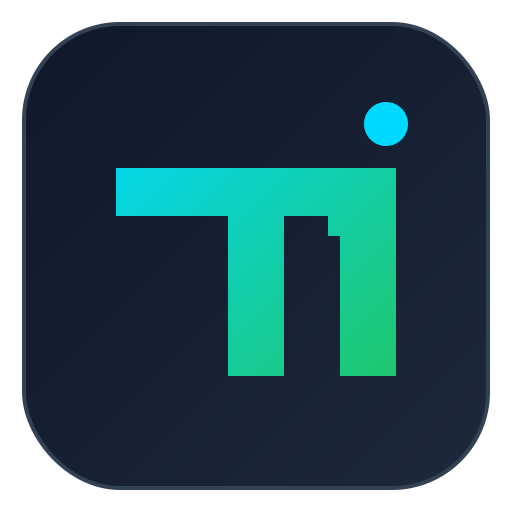

<!--
TideMark
========

File: README.md
Description: Top-level project overview and operator-facing command references.

Responsibility:
- Provide entry documentation for build, test, usage, and design links.

Architectural Position:
- Repository root documentation index.

Author: Silan.Hu
Email: silan.hu@u.nus.edu
Copyright (c) 2026-2027 easynet. All rights reserved.
-->

# TideMark

<div align="center" style="margin: 20px 0;">
  
</div>

<h1 align="center">🚀 TideMark: Agent-First Git Version Truth Layer</h1>
<p align="center"><strong>Deterministic, Git-native version coordinates for agent workflows, release gates, and CI automation.</strong></p>

<p align="center">
  <a href='docs/TECHNICAL_DESIGN.md'></a>
  <a href='docs/CATEGORY_OWNERSHIP_AND_VALIDATION.md'></a>
  <a href='LICENSE'></a>
</p>
<p align="center">
  
  
  
</p>
<p align="center">
  <a href='docs/DELIVERY_REQUIREMENTS.md'></a>
  <a href='docs/DISTRIBUTION_AND_PLUGIN.md'></a>
  <a href='docs/ECOSYSTEM_RELEASE.md'></a>
  <a href='PROJECT_STRUCTURE.md'></a>
</p>

---

## Why TideMark

TideMark is an agent-first Git Version Truth Layer: a deterministic CLI that maps Git history and policy into a reproducible coordinate `x.y.z(.tag)`.

This project is built for automation agents and CI gates that need a verifiable coordinate contract instead of manually bumped version strings.

## Category Definition
- Cognitive anchor: Docker-style immutable trust identity, adapted to Git release coordinates.
- Category statement: TideMark defines and targets the `Git Version Truth Layer`.
- Falsifiable target: by December 31, 2026, TideMark should operate as a release gate in at least 20 public repositories.

## Why Not `git describe`?

`git describe` is useful for human-readable references, but it is not a deterministic release-gate contract by itself.

| Dimension | `git describe` (baseline) | TideMark |
|---|---|---|
| Output model | Description-oriented string | Protocol-like coordinate `x.y.z(.tag)` |
| Tie-breaking contract | Not designed for same-day index determinism policy | Explicit total-order anchor + same-day commit index ordering |
| Time policy | No built-in explicit timezone strategy for coordinate semantics | Explicit timezone policy (`UTC` or fixed offset) |
| Remote drift handling | Typically handled ad hoc in CI scripts | Built-in remote refresh semantics with typed fallback behavior |
| Failure surface | Generic command failure path | Typed error + stable exit code contract for automation |

Use TideMark when the version result is a release gate decision, not only a display label.

## Install

```bash
brew install <your-tap>/tide
# or: pip install tidemark
# or: npm install -g tidemark
# or: download release archive/.deb from GitHub Releases
```

## Quick Start

```bash
tide mark --explain
git tide mark
```

## Agent Workflow Fit

- Deterministic output for release gating and policy engines.
- Typed error/exit surface for script-safe branching.
- Explain mode (`key=value`) for traceable agent decisions.
- Local-only and remote-refresh modes for controlled trust boundaries.

## Core Commands

| Command | Description |
|---|---|
| `tide mark` | Resolve coordinate for `HEAD`. |
| `tide mark --explain` | Emit explainable key-value output. |
| `tide mark --local-only` | Disable remote refresh and use local tags only. |
| `tide file <path>` | Resolve coordinate for a file's last modifying commit. |
| `tide release list` | List release tags recognized by TideMark. |
| `tide config init` | Create `.tidemark.toml` with deterministic defaults. |
| `tide service plan` | Render deterministic systemd unit/timer text. |
| `tide service install` | Install and enable user-level timer (Linux). |
| `tide service uninstall` | Disable and remove user-level timer (Linux). |

## Git Plugin
- Binary `git-tide` is shipped together with `tide`.
- After installation, Git can invoke it as:
```bash
git tide mark
```

## Service Registration (Linux/systemd user)
```bash
tide service plan --interval-minutes 30
tide service install --interval-minutes 30
tide service uninstall
```

## Distribution
- Homebrew formula template: `packaging/homebrew/tide.rb.in`
- Debian build: `./scripts/release/build-deb.sh`
- APT repository builder: `./scripts/release/build-apt-repo.sh`
- PyPI launcher package source: `packaging/pypi/`
- npm launcher package source: `packaging/npm/`
- Release tarball + checksums: `./scripts/release/build-dist.sh`

## Version Management and Auto Release
- `release-from-tidemark` workflow (`.github/workflows/release-from-tidemark.yml`) computes version from current repository state via `tide mark`, then creates `v<version>` GitHub release.
- After release publication (with tag `v*`), `release.yml` builds release assets and publishes ecosystem packages.
- `release-please` workflow remains available as an optional manual semantic-release helper.
- Artifact version naming is normalized from the tag (`v0.1.0` -> `0.1.0`) before packaging.
- Recommended commit format for clean release notes: Conventional Commits (`feat:`, `fix:`, `chore:`).

### Do I Need to Create Tags Manually?

No for the normal path.

1. Run `release-from-tidemark` workflow:
```bash
gh workflow run release-from-tidemark.yml -f ref=main
```
2. Workflow computes TideMark version and creates tag/release automatically.
3. `release.yml` runs automatically on `release.published`.

If no release anchor tag exists yet, bootstrap once:
```bash
gh workflow run release-from-tidemark.yml -f ref=main -f bootstrap_version=0.1.0
```

Manual tag creation is only a fallback path when you intentionally bypass release workflows.

## Release Destinations

When credentials are configured, one release run can publish to:

- GitHub Releases (`tar.gz`, checksums, `.deb`)
- PyPI (`tidemark`)
- npm (`tidemark`)
- Homebrew tap (`Formula/tide.rb`)
- APT repository tree (`gh-pages` or configured branch)

## Release Credentials

Configure repository secrets/variables to enable ecosystem publishers:

- `PYPI_API_TOKEN` for PyPI
- `NPM_TOKEN` for npm
- `HOMEBREW_TAP_TOKEN` + `HOMEBREW_TAP_REPOSITORY` for Homebrew tap
- `APT_ENABLE_PUBLISH=true` to enable APT publish job
- Optional APT signing: `APT_GPG_PRIVATE_KEY`, `APT_GPG_PASSPHRASE`, `APT_GPG_KEY_ID`

## Build
```bash
cargo build
```

## Test
```bash
cargo test
```

## CI Gate Example

See [docs/CI_GATE_EXAMPLE.md](docs/CI_GATE_EXAMPLE.md) for a copy-paste GitHub Actions gate workflow.

## Local Usage Examples

See runnable examples in [examples/README.md](examples/README.md):
- deterministic mark (`examples/01-basic-mark.sh`)
- file coordinate and metadata suffix (`examples/02-file-and-tag.sh`)
- remote refresh versus local-only (`examples/03-remote-refresh.sh`)
- release trigger guide (`examples/04-trigger-release.md`)
- package ecosystem release trigger (`examples/05-trigger-ecosystem-release.md`)

## Design
See [docs/TECHNICAL_DESIGN.md](docs/TECHNICAL_DESIGN.md).
See [docs/CATEGORY_OWNERSHIP_AND_VALIDATION.md](docs/CATEGORY_OWNERSHIP_AND_VALIDATION.md).
See [PROJECT_STRUCTURE.md](PROJECT_STRUCTURE.md).
See [docs/DELIVERY_REQUIREMENTS.md](docs/DELIVERY_REQUIREMENTS.md).
See [docs/DISTRIBUTION_AND_PLUGIN.md](docs/DISTRIBUTION_AND_PLUGIN.md).
See [docs/ECOSYSTEM_RELEASE.md](docs/ECOSYSTEM_RELEASE.md).
